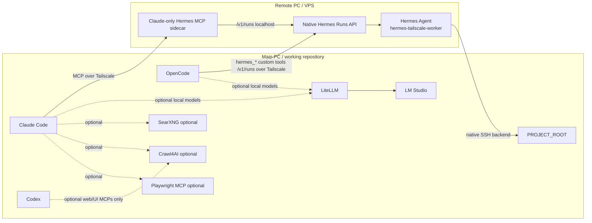

# Harness Layout Native v3.2.0

A reusable, low-overhead layout (framework revision `3.2.0`) for combining Claude Code, OpenCode, Codex, local LM Studio models, LiteLLM, and an optional **native remote Hermes Agent** on another PC/VPS.

LiteLLM runs directly from the **official upstream image** `ghcr.io/berriai/litellm:v${LITELLM_VERSION}`. Harness policy/config files are mounted read-only; the harness does not build a custom LiteLLM image.

The design keeps the main workstation small. All user configuration is in root `.env`; all normal lifecycle/management commands are in the root `Makefile`.

## Important Hermes client split

This version deliberately does **not** force every coding client through one Hermes transport:



- **Claude Code → Hermes:** a dedicated MCP sidecar on the remote Hermes host. It controls native Hermes runs only.
- **OpenCode → Hermes:** project-local `hermes_*` custom tools call the native Hermes `/v1/runs` API directly. No MCP sidecar, no LiteLLM hop, and no model-backed Hermes subagent.
- **Codex → Hermes:** intentionally not configured in this phase.
- **Repository access:** Hermes itself uses its native SSH/file/vision stack through a dedicated main-PC account with project ACLs.

There is no project-file proxy, project binding database, attachment relay, second Hermes runtime, `/workspace` symlink, or per-project SSH keypair in the final architecture.

## Minimal startup

```bash
unzip harness-layout-native-final.zip
cd harness-layout
make init
nano .env
make check
make plan
make up
make verify
```

Default local runtime is only LiteLLM. Optional services are disabled until enabled in `.env`.

## Enable native remote Hermes

Set at least:

```dotenv
HERMES_ENABLED=true
PROJECT_ROOT=/absolute/path/to/your/repository
HERMES_REMOTE_HOST=your-hermes-node.your-tailnet.ts.net
HERMES_REMOTE_API_KEY=<existing native Hermes API key>
HERMES_REMOTE_MODEL=hermes-tailscale-worker
HERMES_SIDECAR_TOKEN=<token created on remote sidecar>
MAIN_TAILSCALE_HOST=your-main-pc.your-tailnet.ts.net
```

Then on the main PC:

```bash
make hermes-host-setup ENABLE_TAILSCALE_SSH=1
make hermes-sidecar-copy
make hermes-remote-instructions
```

Give `.generated/HERMES_REMOTE_SETUP.md` to the remote Hermes/operator and apply it there. Finally:

```bash
make client-config
make hermes-check
```

See [docs/HERMES_NATIVE_SETUP.md](docs/HERMES_NATIVE_SETUP.md) and [docs/HERMES_REMOTE_AGENT_INSTRUCTION.md](docs/HERMES_REMOTE_AGENT_INSTRUCTION.md).

### OpenCode delegation example

Start OpenCode normally with your preferred main model (for example MiniMax), then ask:

```text
Investigate this project. Delegate repository analysis to Hermes and use its result.
```

OpenCode should call `hermes_delegate`. Do **not** use `@generated-hermes`; revision 3.2 intentionally removed the model-backed Hermes subagent path.

For a complete operator/use guide, see [docs/USAGE_EN.md](docs/USAGE_EN.md).

## Files, images and documents

Hermes receives the absolute repository path as task context and accesses it with **its own native SSH backend**:

```text
Hermes terminal/read_file/patch/search/vision
                 |
                 v
        SSH / Tailscale SSH
                 |
                 v
      hermes-worker@MAIN-PC
                 |
                 v
             PROJECT_ROOT
```

- Source, Markdown, JSON, PDFs, archives, etc. are ordinary repository files.
- Repository images are referenced by repository path; Hermes 0.20.5+ can resolve image bytes through a non-local SSH backend for native vision processing.
- If the main Hermes model is text-only, configure a valid `auxiliary.vision` route on the remote profile.
- External files can be staged safely into the repository:

```bash
make hermes-import FILE=/path/to/specification.pdf
```

## Web stack

Firecrawl and its Redis/RabbitMQ/PostgreSQL/browser ecosystem were removed.

Optional components are now:

- **SearXNG** — URL discovery/search; optional and AGPL-3.0.
- **Crawl4AI** — crawl/render/extract known public pages; default crawler choice.
- **Playwright MCP** — UI/browser interaction/testing.

See [docs/WEB_STACK.md](docs/WEB_STACK.md) and [docs/THIRD_PARTY_LICENSES.md](docs/THIRD_PARTY_LICENSES.md).

## Skills

Canonical shared project skills live in `.agents/skills/`. Only four small core
skills are directly discoverable. Optional skills live under
`.agents/skills/catalog/` and are selected on demand by the deterministic
`skill-router`, so their metadata and full bodies are not loaded into every
request.

```bash
printf '%s' 'Fix a flaky session restore bug' | \
  python3 scripts/skill_router.py --profile balanced

python3 scripts/session_state.py start \
  --goal 'Add resumable task state' \
  --acceptance 'resume detects working-file drift'
```

Use `--profile local-small` for weaker/local models. The router returns exact
skill paths and a bounded execution contract; read only the selected paths.

```bash
make skills-sync-local   # core -> Claude; optional catalog stays in repository
make skills-sync-remote  # core -> Hermes; catalog remains available over native SSH
make skills-check
```

See [docs/SKILLS.md](docs/SKILLS.md) and the
[research recommendation trace](docs/REPORT_RECOMMENDATION_MATRIX.md).

## Management

Run `make` for help. Docker lifecycle remains centralized: `make up`, `stop`, `down`, `status`, and `logs`. `stop/down/status/logs` always use all Compose profiles so previously enabled services remain under control.
