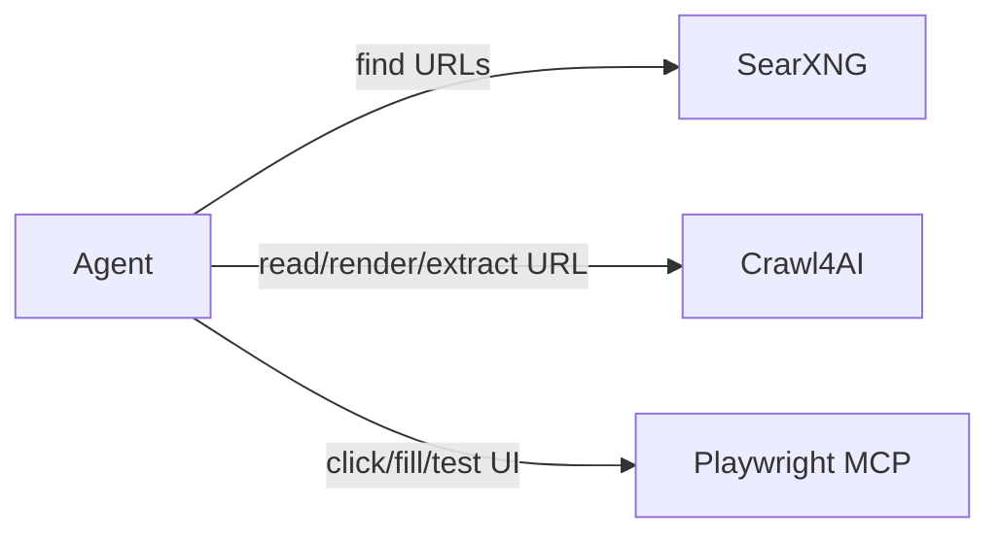

# Web stack

The project deliberately uses three orthogonal optional capabilities instead of a large crawling ecosystem.

## SearXNG

Search/discovery only. Use when you need to find relevant public URLs. It is optional because some coding agents/Hermes installations already have their own web search.

## Crawl4AI

The default self-hosted crawler/extractor. It is well suited to known URLs, rendered pages, Markdown/text extraction and agent-oriented web ingestion. It is one main service plus a tiny compatibility MCP bridge in this layout.

## Playwright MCP

Interactive browser automation/UI testing. It is not a crawler replacement: use it when the task requires clicking, forms, stateful interaction, screenshots, or UI verification.

## Why Firecrawl was removed

Firecrawl overlaps strongly with the SearXNG + Crawl4AI workflow but self-hosting its full platform brings API/browser/queue/database infrastructure. That is excessive for this reusable single-developer/enterprise-project layout unless a team specifically needs Firecrawl's queue/batch/platform features.

Crawl4AI v0.9.2 is distributed under Apache-2.0 with an additional attribution requirement in its repository license. Firecrawl core is AGPL-3.0. Both can be used commercially, but Apache-style licensing is generally simpler for internal enterprise adoption; AGPL can impose source-availability obligations when modified software is offered over a network. This document is engineering guidance, not legal advice.
